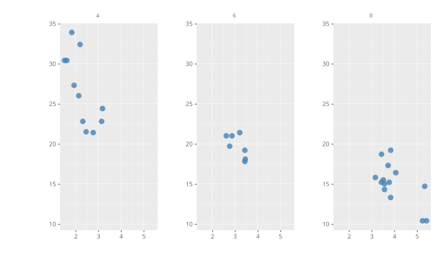

<p align="center">
  
</p>

# ggpbi — Grammar of Graphics for Power BI

**Build ggplot2-style charts in Power BI. No R, no Python, no runtime to install.**

ggpbi is a Power BI custom visual that maps fields to aesthetics and stacks
geometry layers, the way ggplot2 does — as a native TypeScript/D3 visual, so
it renders as fast as any built-in visual and works in the Power BI Service.

<p align="center">
  
</p>

```typescript
ggpbi()
  .data(mtcars)
  .aes({ x: 'wt', y: 'mpg', color: 'cyl' })
  .geom('point')
  .geom('smooth', { method: 'lm' })
  .facet({ col: 'cyl' })
  .renderTo(element);
```

In Power BI you build the same chart by dropping fields into wells — the code
above is what the Format Pane produces. (Switch on **Theme → Show ggpbi code
(debug)** and the visual shows you exactly this chain for the chart on screen.)

## Install

1. Download `ggpbi-<version>.pbiviz` from the
   [latest release](https://github.com/efelcie/ggpbi/releases/latest).
2. In Power BI Desktop: **Insert → More visuals → Import a visual from a file**.
3. Pick the `.pbiviz`, drop the visual on the canvas, and start binding fields.

The visual is not on AppSource yet, so Power BI will warn that it comes from
an untrusted source. That is expected for a file import.

## Demo report

Each release also provides `GgpbiDemo-<version>.zip` under **Assets**. Extract
it and open `GgpbiDemo/GgpbiDemo.pbip` in Power BI Desktop. The demo embeds the
matching ggpbi visual and uses inlined sample data, so it needs no external
data source. On first open, click **Refresh** once to build the local model
cache.

## Your first chart

Drop a field into **X** and one into **Y** — that is enough. ggpbi picks a
geom that fits the two scale types:

| X | Y | you get |
|---|---|---|
| number | number | scatter plot |
| category | number | bar chart |
| date | number | line chart |
| number | *(empty)* | histogram |
| *(empty)* | number | boxplot |

Add a field to **Color** to split by group, to **Detail** to keep rows
separate, to **Size** for a bubble chart. Everything else — geom, scales,
theme, faceting, reference lines — lives in the Format Pane.

## What's in it

**Geoms** — point, line, bar, col, area, text, boxplot, violin, histogram,
density, smooth (lm / loess / moving average), segment, pointrange, and the
reference lines hline / vline / abline.

**Grammar** — aesthetics (x, y, color, fill, size, shape, alpha, group,
label), positions (identity, stack, dodge, fill, jitter), scales (linear,
log, sqrt, time, category) with locale-aware number and date formats,
faceting by row and column, and gghighlight-style highlighting.

**Power BI native** — cross-filtering by click, native tooltips, right-click
context menu, report themes, high-contrast mode, and style presets via
`ggpbi-theme.json`.

## Documentation

- **[Guide](docs/guide.md)** — every geom, scale, theme and Power BI field
  well, with runnable examples
- **[Sample Gallery](docs/gallery.md)** — classic ggplot2 examples next to
  their ggpbi equivalent; every image is generated from the code beside it
- **[ggpbir Reference](docs/ggpbir-reference.md)** — the JSON spec format

## Building from source

```bash
npm install
npm run build      # tsc
npm test           # vitest
npm run demo:build && npx serve demo -p 3333   # interactive playground
```

Packaging the visual needs the Power BI tooling:

```bash
npm install -g powerbi-visuals-tools
pbiviz package     # → dist/ggpbi.pbiviz
```

## License

[MIT](LICENSE) © Peter Flucher

ggpbi ships as a single bundle containing d3 and the Power BI formatting
utilities. Their copyright notices are reproduced in
[THIRD-PARTY-NOTICES.md](THIRD-PARTY-NOTICES.md) — 41 packages, all under
permissive licences (ISC, MIT, BSD-3-Clause, Unlicense). No copyleft
dependency ships with the visual, and a test enforces that.
