# ggplot2 Sample Gallery

<!-- GENERATED FILE — do not edit by hand.
     Edit docs/gallery/samples.ts and run: npm run gallery -->

Classic ggplot2 examples reproduced with ggpbi, side by side. Every image
below was rendered by the exact ggpbi code shown next to it — the gallery is
regenerated from [`docs/gallery/samples.ts`](gallery/samples.ts) with
`npm run gallery`, and `tests/gallery.test.ts` verifies that each sample
renders and that this page stays in sync.

**Try it yourself:** each snippet assumes a container element `el`, the
builder from the library, and a dataset from
[`docs/gallery/data.ts`](gallery/data.ts) (verbatim copies of the classic R
datasets `mtcars`, `iris`, `ToothGrowth`, `economics`):

```js
import { ggpbi, themeDark, themeMinimal } from 'ggpbi';
import { mtcars, iris, toothGrowth, economics } from './gallery/data';
```

See the [guide](guide.md) for the full API.

## Contents

- [Scatter plot](#scatter-plot)
- [Scatter plot with colour mapping](#scatter-plot-with-colour-mapping)
- [Bubble chart (size aesthetic)](#bubble-chart-size-aesthetic)
- [Linear regression with confidence band](#linear-regression-with-confidence-band)
- [LOESS smoother](#loess-smoother)
- [Reference lines](#reference-lines)
- [Time series line](#time-series-line)
- [Multiple series (colour grouping)](#multiple-series-colour-grouping)
- [Bar chart (stat_count)](#bar-chart-statcount)
- [Stacked bars (weighted count)](#stacked-bars-weighted-count)
- [Grouped bars (position dodge)](#grouped-bars-position-dodge)
- [Horizontal bar chart (coord_flip)](#horizontal-bar-chart-coordflip)
- [Histogram](#histogram)
- [Density curves](#density-curves)
- [Notched boxplot](#notched-boxplot)
- [Violin plot with jittered points](#violin-plot-with-jittered-points)
- [Jittered points](#jittered-points)
- [Stacked area chart](#stacked-area-chart)
- [Faceting (small multiples)](#faceting-small-multiples)
- [Wrapped facets (facet_wrap)](#wrapped-facets-facetwrap)
- [Text labels](#text-labels)
- [Repelled labels (ggrepel)](#repelled-labels-ggrepel)
- [Highlighting (gghighlight)](#highlighting-gghighlight)
- [Highlight + direct labels (the Valiant)](#highlight-direct-labels-the-valiant)
- [Dumbbell — min and max per category](#dumbbell-min-and-max-per-category)
- [Dumbbell from pre-aggregated data (geom_segment)](#dumbbell-from-pre-aggregated-data-geomsegment)
- [Point range (mean ± sd)](#point-range-mean-sd)
- [Dark theme](#dark-theme)
- [Not yet in ggpbi](#not-yet-in-ggpbi)

## Scatter plot

**ggplot2**

```r
ggplot(mtcars, aes(wt, mpg)) +
  geom_point()
```

**ggpbi**

```js
ggpbi()
  .data(mtcars)
  .aes({ x: 'wt', y: 'mpg' })
  .geom('point')
  .size(640, 400)
  .renderTo(el);
```

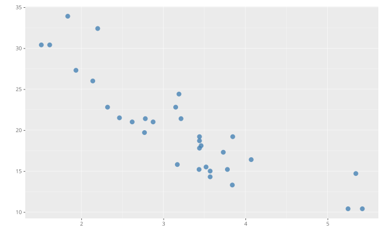

## Scatter plot with colour mapping

**ggplot2**

```r
ggplot(iris, aes(Sepal.Length, Sepal.Width, colour = Species)) +
  geom_point(size = 2)
```

**ggpbi**

```js
ggpbi()
  .data(iris)
  .aes({ x: 'Sepal.Length', y: 'Sepal.Width', color: 'Species' })
  .geom('point', { size: 5 })
  .size(640, 400)
  .renderTo(el);
```

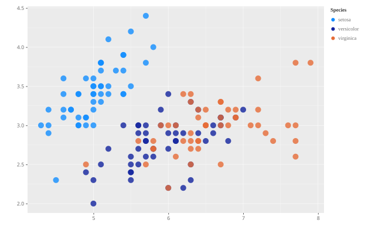

## Bubble chart (size aesthetic)

**ggplot2**

```r
ggplot(mtcars, aes(wt, mpg, size = hp)) +
  geom_point(alpha = 0.6)
```

**ggpbi**

```js
ggpbi()
  .data(mtcars)
  .aes({ x: 'wt', y: 'mpg', size: 'hp' })
  .geom('point', { alpha: 0.6 })
  .size(640, 400)
  .renderTo(el);
```

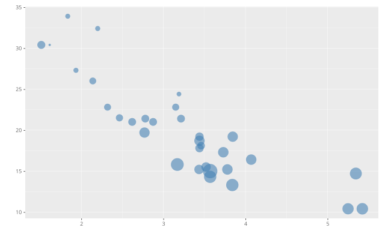

## Linear regression with confidence band

**ggplot2**

```r
ggplot(mtcars, aes(wt, mpg)) +
  geom_point() +
  geom_smooth(method = "lm")
```

**ggpbi**

```js
ggpbi()
  .data(mtcars)
  .aes({ x: 'wt', y: 'mpg' })
  .geom('point')
  .geom('smooth', { method: 'lm' })
  .size(640, 400)
  .renderTo(el);
```

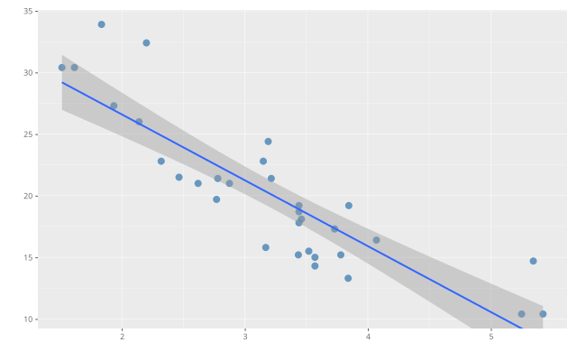

## LOESS smoother

**ggplot2**

```r
ggplot(mtcars, aes(disp, mpg)) +
  geom_point() +
  geom_smooth(method = "loess")
```

**ggpbi**

```js
ggpbi()
  .data(mtcars)
  .aes({ x: 'disp', y: 'mpg' })
  .geom('point')
  .geom('smooth', { method: 'loess' })
  .size(640, 400)
  .renderTo(el);
```

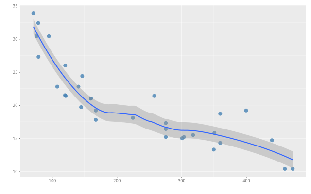

## Reference lines

**ggplot2**

```r
ggplot(mtcars, aes(wt, mpg)) +
  geom_point() +
  geom_hline(yintercept = mean(mtcars$mpg), colour = "red", linetype = "dashed") +
  geom_vline(xintercept = mean(mtcars$wt), linetype = "dashed")
```

**ggpbi**

```js
const mean = (f) => mtcars.reduce((s, d) => s + d[f], 0) / mtcars.length;
ggpbi()
  .data(mtcars)
  .aes({ x: 'wt', y: 'mpg' })
  .geom('point')
  .geom('hline', { yintercept: mean('mpg'), color: 'red', linetype: 'dashed' })
  .geom('vline', { xintercept: mean('wt'), linetype: 'dashed' })
  .size(640, 400)
  .renderTo(el);
```

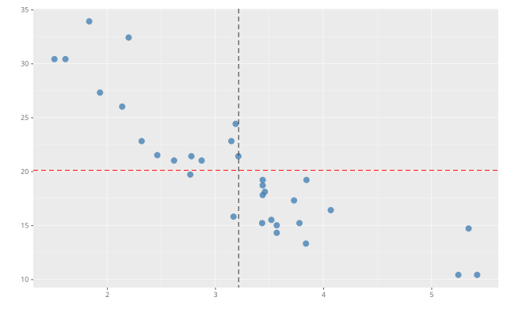

> Reference lines ignore the bound data — their position comes from the layer config alone, so they overlay any chart type.

## Time series line

**ggplot2**

```r
ggplot(economics, aes(date, unemploy)) +
  geom_line()
```

**ggpbi**

```js
ggpbi()
  .data(economics)
  .aes({ x: 'date', y: 'unemploy' })
  .geom('line')
  .labels('date', 'unemploy (thousands)')
  .size(640, 400)
  .renderTo(el);
```

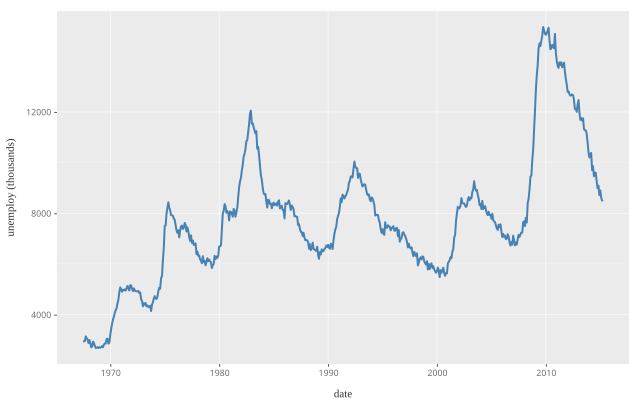

## Multiple series (colour grouping)

**ggplot2**

```r
economics_long <- economics |>
  pivot_longer(c(psavert, uempmed))
ggplot(economics_long, aes(date, value, colour = name)) +
  geom_line()
```

**ggpbi**

```js
const long = economics.flatMap((d) => [
  { date: d.date, series: 'psavert', value: d.psavert },
  { date: d.date, series: 'uempmed', value: d.uempmed },
]);
ggpbi()
  .data(long)
  .aes({ x: 'date', y: 'value', color: 'series' })
  .geom('line')
  .size(640, 400)
  .renderTo(el);
```

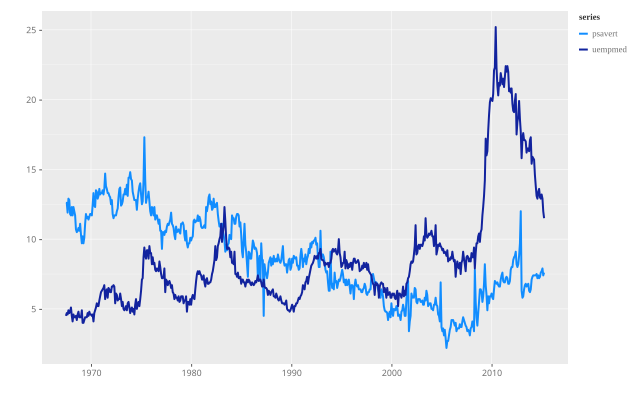

## Bar chart (stat_count)

**ggplot2**

```r
ggplot(mtcars, aes(factor(cyl))) +
  geom_bar()
```

**ggpbi**

```js
ggpbi()
  .data(mtcars)
  .aes({ x: 'cyl' })
  .geom('bar')
  .scale({ x: 'category' })
  .labels('cyl', 'count')
  .size(640, 400)
  .renderTo(el);
```

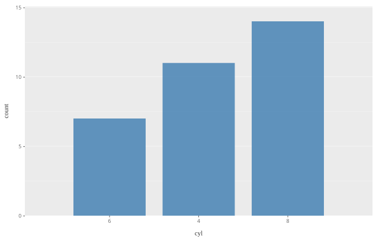

> Like `factor(cyl)` in R, `scale({ x: 'category' })` forces the numeric field onto a discrete axis.

## Stacked bars (weighted count)

**ggplot2**

```r
ggplot(ToothGrowth, aes(factor(dose), fill = supp)) +
  geom_bar(aes(weight = len))
```

**ggpbi**

```js
ggpbi()
  .data(toothGrowth)
  .aes({ x: 'dose', color: 'supp', weight: 'len' })
  .geom('bar', { position: 'stack' })
  .scale({ x: 'category' })
  .labels('dose', 'sum of len')
  .size(640, 400)
  .renderTo(el);
```

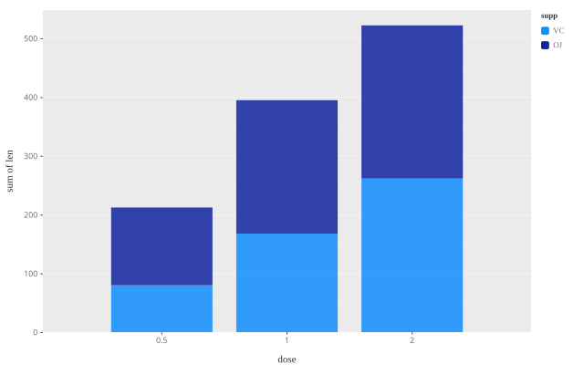

## Grouped bars (position dodge)

**ggplot2**

```r
ggplot(ToothGrowth, aes(factor(dose), fill = supp)) +
  geom_bar(aes(weight = len), position = "dodge")
```

**ggpbi**

```js
ggpbi()
  .data(toothGrowth)
  .aes({ x: 'dose', color: 'supp', weight: 'len' })
  .geom('bar', { position: 'dodge' })
  .scale({ x: 'category' })
  .labels('dose', 'sum of len')
  .size(640, 400)
  .renderTo(el);
```

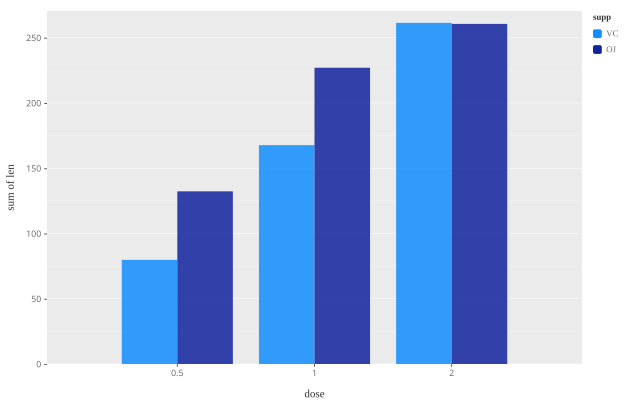

## Horizontal bar chart (coord_flip)

**ggplot2**

```r
mtcars |>
  slice_max(hp, n = 10) |>
  ggplot(aes(hp, reorder(rownames, hp))) +
  geom_col()
```

**ggpbi**

```js
const top = [...mtcars].sort((a, b) => a.hp - b.hp).slice(-10);
ggpbi()
  .data(top)
  .aes({ x: 'hp', y: 'name' })
  .geom('col', { orientation: 'y' })
  .size(640, 400)
  .renderTo(el);
```

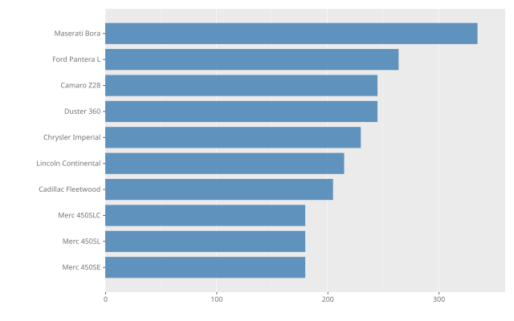

> ggpbi has no `coord_flip()` — horizontal bars use `orientation: 'y'` instead, like modern ggplot2.

## Histogram

**ggplot2**

```r
ggplot(economics, aes(psavert)) +
  geom_histogram(binwidth = 1)
```

**ggpbi**

```js
ggpbi()
  .data(economics)
  .aes({ x: 'psavert' })
  .geom('histogram', { binwidth: 1 })
  .size(640, 400)
  .renderTo(el);
```

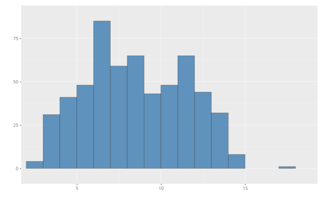

## Density curves

**ggplot2**

```r
ggplot(iris, aes(Sepal.Length, fill = Species)) +
  geom_density(alpha = 0.3)
```

**ggpbi**

```js
ggpbi()
  .data(iris)
  .aes({ x: 'Sepal.Length', color: 'Species' })
  .geom('density', { fill: true })
  .size(640, 400)
  .renderTo(el);
```

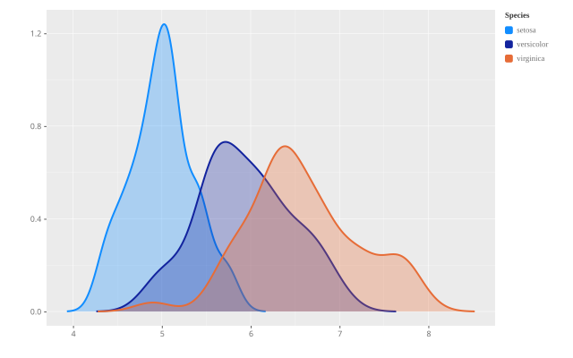

> Bandwidth follows Silverman’s rule like R — tune it with `adjust` (2 = smoother, 0.5 = wigglier) or a fixed `bw`.

## Notched boxplot

**ggplot2**

```r
ggplot(ToothGrowth, aes(factor(dose), len)) +
  geom_boxplot(notch = TRUE)
```

**ggpbi**

```js
ggpbi()
  .data(toothGrowth)
  .aes({ x: 'dose', y: 'len' })
  .geom('boxplot', { boxNotch: true })
  .scale({ x: 'category' })
  .size(640, 400)
  .renderTo(el);
```

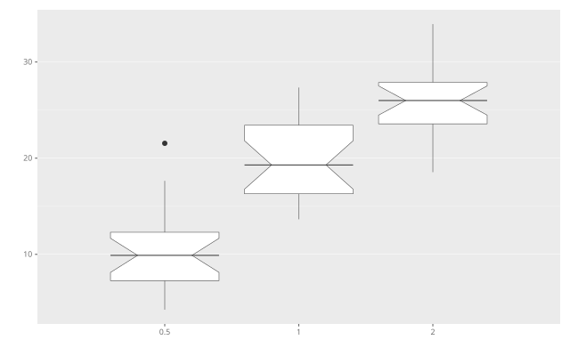

## Violin plot with jittered points

**ggplot2**

```r
ggplot(ToothGrowth, aes(factor(dose), len)) +
  geom_violin() +
  geom_jitter(width = 0.1, alpha = 0.5)
```

**ggpbi**

```js
ggpbi()
  .data(toothGrowth)
  .aes({ x: 'dose', y: 'len' })
  .geom('violin')
  .geom('point', { position: 'jitter', jitterWidth: 0.15, alpha: 0.5 })
  .scale({ x: 'category' })
  .size(640, 400)
  .renderTo(el);
```

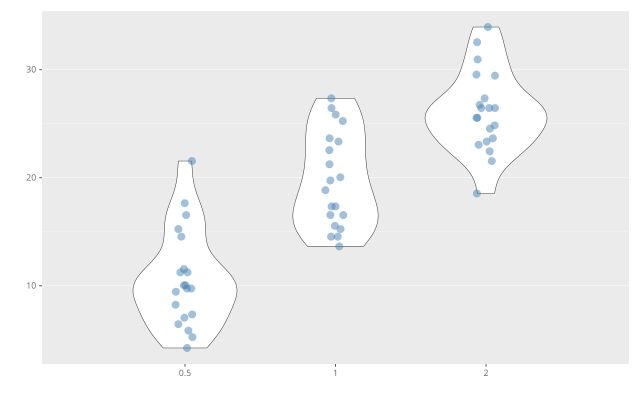

> Same Gaussian KDE as `density` under the hood; `violinScale` switches between ggplot2’s area/count/width scaling.

## Jittered points

**ggplot2**

```r
ggplot(ToothGrowth, aes(factor(dose), len)) +
  geom_jitter(width = 0.2, alpha = 0.7)
```

**ggpbi**

```js
ggpbi()
  .data(toothGrowth)
  .aes({ x: 'dose', y: 'len' })
  .geom('point', { position: 'jitter', jitterWidth: 0.3, alpha: 0.7 })
  .scale({ x: 'category' })
  .size(640, 400)
  .renderTo(el);
```

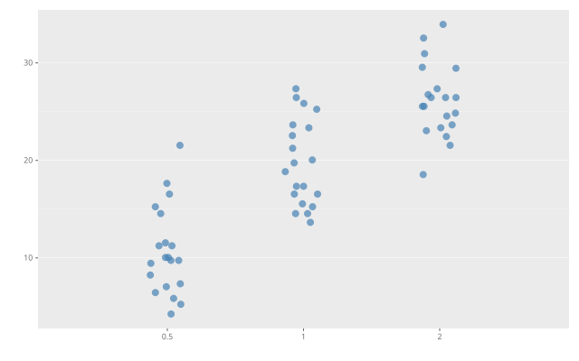

> Jitter offsets are seeded, so re-rendering produces identical output.

## Stacked area chart

**ggplot2**

```r
economics_long <- economics |>
  pivot_longer(c(psavert, uempmed))
ggplot(economics_long, aes(date, value, fill = name)) +
  geom_area()
```

**ggpbi**

```js
const long = economics.flatMap((d) => [
  { date: d.date, series: 'psavert', value: d.psavert },
  { date: d.date, series: 'uempmed', value: d.uempmed },
]);
ggpbi()
  .data(long)
  .aes({ x: 'date', y: 'value', color: 'series' })
  .geom('area', { position: 'stack', alpha: 0.8 })
  .size(640, 400)
  .renderTo(el);
```

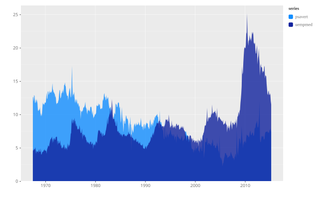

## Faceting (small multiples)

**ggplot2**

```r
ggplot(mtcars, aes(wt, mpg)) +
  geom_point() +
  facet_grid(. ~ cyl)
```

**ggpbi**

```js
ggpbi()
  .data(mtcars)
  .aes({ x: 'wt', y: 'mpg' })
  .geom('point')
  .facet({ col: 'cyl' })
  .size(640, 400)
  .renderTo(el);
```


## Wrapped facets (facet_wrap)

**ggplot2**

```r
economics |>
  mutate(decade = paste0(10 * (year(date) %/% 10), "s")) |>
  ggplot(aes(date, unemploy)) +
  geom_line() +
  facet_wrap(~ decade, scales = "free_x")
```

**ggpbi**

```js
const byDecade = economics.map((d) => ({
  ...d, decade: 10 * Math.floor(d.date.getFullYear() / 10) + 's',
}));
ggpbi()
  .data(byDecade)
  .aes({ x: 'date', y: 'unemploy' })
  .geom('line')
  .facet({ wrap: 'decade', freeX: true })
  .size(640, 440)
  .renderTo(el);
```

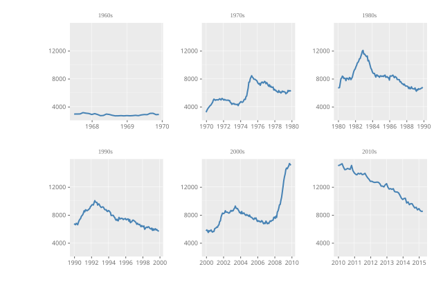

> Six decades wrap into a 3×2 grid (`ceil(sqrt(n))` columns by default); `ncol`/`nrow` fix the shape.

## Text labels

**ggplot2**

```r
mtcars |>
  filter(hp > 200) |>
  ggplot(aes(wt, mpg, label = rownames)) +
  geom_point() +
  geom_text(hjust = "inward", vjust = "inward", check_overlap = TRUE)
```

**ggpbi**

```js
const strong = mtcars.filter((d) => d.hp > 200);
ggpbi()
  .data(strong)
  .aes({ x: 'wt', y: 'mpg', label: 'name' })
  .geom('point')
  .geom('text', { hjust: 'inward', vjust: 'inward', checkOverlap: true })
  .size(640, 400)
  .renderTo(el);
```

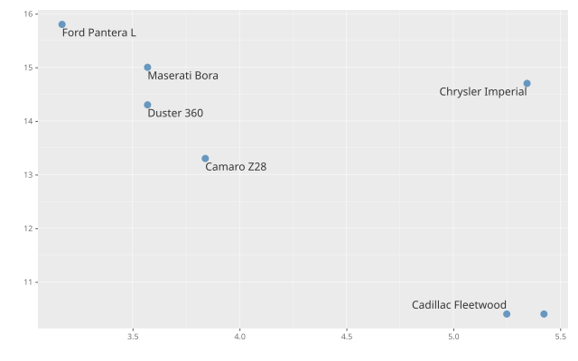

> `inward` keeps edge labels inside the panel; `checkOverlap` hides labels that would collide (first in data order wins) — both straight from ggplot2.

## Repelled labels (ggrepel)

**ggplot2**

```r
library(ggrepel)
ggplot(mtcars, aes(wt, mpg, label = rownames(mtcars))) +
  geom_point() +
  geom_text_repel(size = 3)
```

**ggpbi**

```js
ggpbi()
  .data(mtcars)
  .aes({ x: 'wt', y: 'mpg', label: 'name' })
  .geom('point')
  .geom('text', { repel: true, size: 10 })
  .size(640, 480)
  .renderTo(el);
```

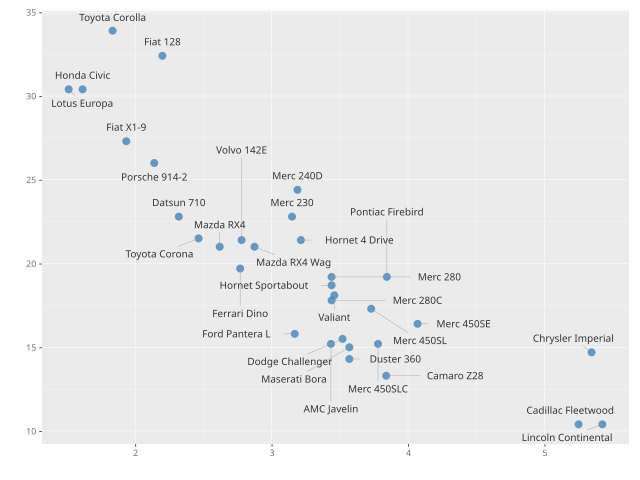

> A deterministic force layout: labels repel each other and every point, a spring pulls them home, and displaced labels get a connector line — like R’s ggrepel.

## Highlighting (gghighlight)

**ggplot2**

```r
library(gghighlight)
ggplot(iris, aes(Sepal.Length, Sepal.Width, colour = Species)) +
  geom_point(size = 2) +
  gghighlight(Species == "virginica")
```

**ggpbi**

```js
ggpbi()
  .data(iris)
  .aes({ x: 'Sepal.Length', y: 'Sepal.Width', color: 'Species' })
  .geom('point', { size: 5 })
  .highlight({ filter: (d) => d.Species === 'virginica' })
  .size(640, 400)
  .renderTo(el);
```

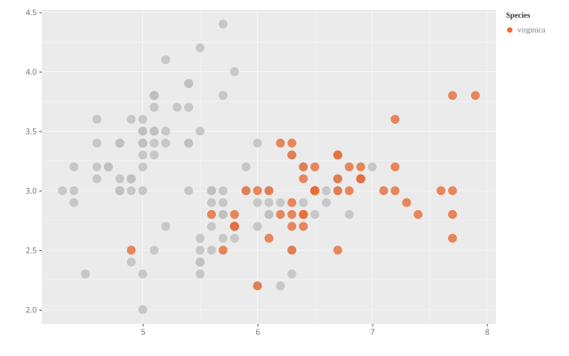

> Unhighlighted groups turn grey, drop out of the legend and are drawn underneath — highlighted groups keep exactly their normal colours. In Power BI: the Highlight card with a comma-separated value list.

## Highlight + direct labels (the Valiant)

**ggplot2**

```r
library(gghighlight)
ggplot(mtcars, aes(wt, mpg, label = rownames(mtcars))) +
  geom_point() +
  gghighlight(rownames(mtcars) == "Valiant", label_key = rownames)
```

**ggpbi**

```js
ggpbi()
  .data(mtcars)
  .aes({ x: 'wt', y: 'mpg', label: 'name' })
  .geom('point', { size: 5 })
  .geom('text', { repel: true })
  .highlight({ filter: (d) => d.name === 'Valiant' })
  .size(640, 400)
  .renderTo(el);
```

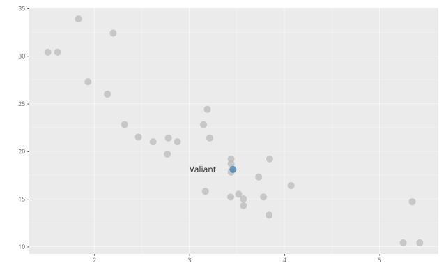

> With a highlight active, text layers label ONLY the highlighted rows (gghighlight’s direct labeling) — exempt a layer with `highlight: false` to keep everything. In Power BI: Highlight card + the per-layer “Apply highlight” toggle.

## Dumbbell — min and max per category

**ggplot2**

```r
worst <- mtcars %>% group_by(cyl) %>% slice_min(mpg)
best  <- mtcars %>% group_by(cyl) %>% slice_max(mpg)
ggplot(mtcars, aes(mpg, factor(cyl))) +
  geom_line(colour = "grey75", linewidth = 2) +
  geom_point(data = worst, colour = "#F28E2B", size = 3) +
  geom_point(data = best,  colour = "#4E79A7", size = 3) +
  ggrepel::geom_text_repel(
    data = rbind(worst, best),
    aes(label = paste(rownames(.data), mpg)))
```

**ggpbi**

```js
ggpbi()
  .data(mtcars)
  .aes({ x: 'mpg', y: 'cyl', label: 'name' })
  .geom('line', { color: '#C8D0D9', size: 2 })
  .geom('point', { filter: 'min', color: '#F28E2B', size: 5 })
  .geom('point', { filter: 'max', color: '#4E79A7', size: 5 })
  .geom('text', { filter: 'min', repel: true, color: '#F28E2B', size: 10, labelTemplate: '{label} {x:.1f}' })
  .geom('text', { filter: 'max', repel: true, color: '#4E79A7', size: 10, labelTemplate: '{label} {x:.1f}' })
  .scale({ y: 'category' })
  .labels('Miles per gallon', 'Cylinders')
  .size(640, 400)
  .renderTo(el);
```

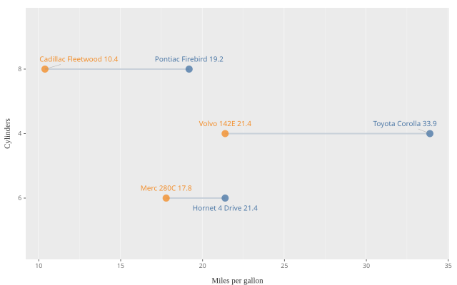

> Per-layer `filter` is ggplot2’s layer-local `data =`: `'min'`/`'max'`/`'extremes'` keep the extreme row(s) per category, a function keeps arbitrary subsets. `labelTemplate` composes “name value” labels; repel layers coordinate across layers, so min and max labels never collide. In Power BI: the per-layer “Filter rows” dropdown and “Label template” input.

## Dumbbell from pre-aggregated data (geom_segment)

**ggplot2**

```r
stats <- mtcars %>% group_by(cyl) %>%
  summarise(lo = min(mpg), hi = max(mpg))
ggplot(stats, aes(x = lo, xend = hi, y = factor(cyl))) +
  geom_segment(colour = "grey75", linewidth = 2) +
  geom_point(aes(x = lo), colour = "#F28E2B", size = 3) +
  geom_point(aes(x = hi), colour = "#4E79A7", size = 3)
```

**ggpbi**

```js
const stats = Object.values(mtcars.reduce((acc, d) => {
  const g = acc[d.cyl] ?? (acc[d.cyl] = { cyl: d.cyl, lo: Infinity, hi: -Infinity });
  g.lo = Math.min(g.lo, d.mpg);
  g.hi = Math.max(g.hi, d.mpg);
  return acc;
}, {}));
ggpbi()
  .data(stats)
  .aes({ x: 'lo', y: 'cyl', xend: 'hi' })
  .geom('segment', { color: '#C8D0D9', size: 2 })
  .geom('point', { size: 5, color: '#F28E2B' })
  .geom('point', { aes: { x: 'hi' }, size: 5, color: '#4E79A7' })
  .scale({ y: 'category' })
  .labels('Miles per gallon', 'Cylinders')
  .size(640, 400)
  .renderTo(el);
```

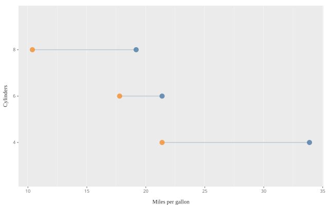

> The model-first dumbbell: the min/max columns already exist in the data (in Power BI: DAX measures), `segment` just connects x → xend. Compare the [filter-based dumbbell](#dumbbell--min-and-max-per-category), which computes the extremes in the visual. In Power BI: drag two measures into X (x1 = start, x2 = end) and set a layer to **Segment**.

## Point range (mean ± sd)

**ggplot2**

```r
ggplot(mtcars, aes(factor(cyl), mpg)) +
  stat_summary(fun = mean,
               fun.min = \(x) mean(x) - sd(x),
               fun.max = \(x) mean(x) + sd(x),
               geom = "pointrange")
```

**ggpbi**

```js
const stats = Object.values(mtcars.reduce((acc, d) => {
  const g = acc[d.cyl] ?? (acc[d.cyl] = { cyl: d.cyl, vals: [] });
  g.vals.push(d.mpg);
  return acc;
}, {})).map(g => {
  const mean = g.vals.reduce((a, b) => a + b, 0) / g.vals.length;
  const sd = Math.sqrt(g.vals.reduce((a, b) => a + (b - mean) * (b - mean), 0) / (g.vals.length - 1));
  return { cyl: g.cyl, mean, lo: mean - sd, hi: mean + sd };
});
ggpbi()
  .data(stats)
  .aes({ x: 'cyl', y: 'mean', ymin: 'lo', ymax: 'hi' })
  .geom('pointrange', { size: 1.5 })
  .scale({ x: 'category' })
  .labels('Cylinders', 'Miles per gallon (mean ± sd)')
  .size(640, 400)
  .renderTo(el);
```

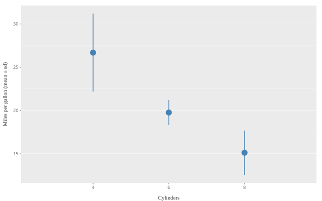

> Vertical when `ymin`/`ymax` are mapped, horizontal with `xmin`/`xmax`. `size` sets the line width; the dot is `size * fatten` (default 4), like ggplot2. In Power BI: three measures in Y (y1 = centre, y2 = min, y3 = max) — or in X for the horizontal version — and layer type **Point range**.

## Dark theme

**ggplot2**

```r
ggplot(iris, aes(Sepal.Length, Sepal.Width, colour = Species)) +
  geom_point(size = 2) +
  theme_dark()
```

**ggpbi**

```js
ggpbi()
  .data(iris)
  .aes({ x: 'Sepal.Length', y: 'Sepal.Width', color: 'Species' })
  .geom('point', { size: 5 })
  .theme(themeDark())
  .size(640, 400)
  .renderTo(el);
```

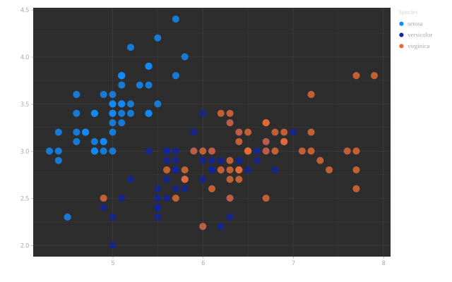

## Not yet in ggpbi

Classic ggplot2 building blocks that have **no ggpbi equivalent yet** — the
gallery grows as these land (tracked in the
[issue backlog](https://github.com/efelcie/ggpbi/issues)):

- `geom_errorbar()` + `stat_summary()` (ggpbi has `pointrange`, but no crossbar/errorbar caps and no summary stat)
- `geom_tile()` — heatmaps
- `geom_ribbon()` as a standalone geom (ggpbi draws ribbons only as smooth confidence bands)
- `geom_step()`
- `annotate()` / `geom_label()` (text with background box)
- `coord_polar()` — pie/donut charts (Power BI's native pie visual covers this)
